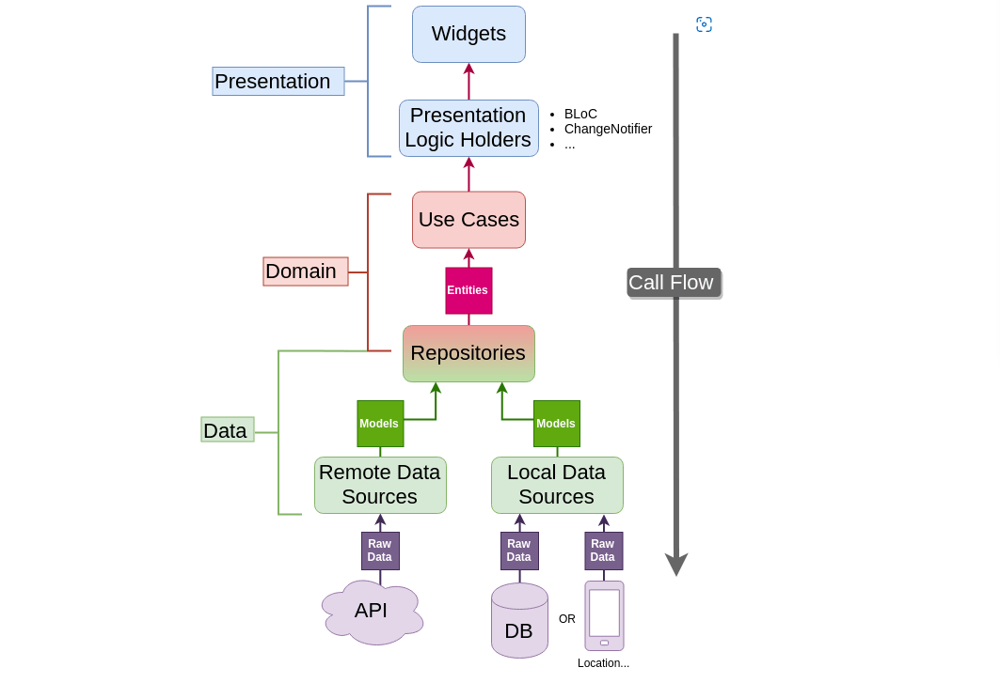

<div id="top"></div>
<!--
*** Thanks for checking out the Best-README-Template. If you have a suggestion
*** that would make this better, please fork the repo and create a pull request
*** or simply open an issue with the tag "enhancement".
*** Don't forget to give the project a star!
*** Thanks again! Now go create something AMAZING! :D
-->


<!-- PROJECT SHIELDS -->
<!--
*** I'm using markdown "reference style" links for readability.
*** Reference links are enclosed in brackets [ ] instead of parentheses ( ).
*** See the bottom of this document for the declaration of the reference variables
*** for contributors-url, forks-url, etc. This is an optional, concise syntax you may use.
*** https://www.markdownguide.org/basic-syntax/#reference-style-links
-->
[![Contributors][contributors-shield]][contributors-url]
[](https://github.com/vedantkulkarni/GSOC_Organizations_App/network)
[](https://github.com/vedantkulkarni/GSOC_Organizations_App/stargazers)
[](https://github.com/vedantkulkarni/GSOC_Organizations_App/issues)
[![LinkedIn][linkedin-shield]][linkedin-url]


<!-- PROJECT LOGO -->
<br />
<div align="center">
  <a href="https://summerofcode.withgoogle.com/">
    
  </a>

  <h3 align="center">GSOC Organizations App</h3>

  <p align="center">
    Get to know about year wise organizations, projects and more!
    <br />
    <a href=""><strong>Get it on Playstore »</strong></a>
    <br />
    <br />
    <a href="">View Demo</a>
    ·
    <a href="https://github.com/vedantkulkarni/GSOC_Organizations_App/issues">Report Bug</a>
    ·
    <a href="https://github.com/vedantkulkarni/GSOC_Organizations_App/issues">Request Feature</a>
  </p>
</div>


<!-- TABLE OF CONTENTS -->
<details>
  <summary>Table of Contents</summary>
  <ol>
    <li>
      <a href="#about-the-project">About The Project</a>
      <ul>
        <li><a href="#built-with">Built With</a></li>
      </ul>
    </li>
    <li>
      <a href="#getting-started">Getting Started</a>
      <ul>
        <li><a href="#prerequisites">Prerequisites</a></li>
        <li><a href="#installation">Installation</a></li>
      </ul>
    </li>
    <li><a href="#usage">Usage</a></li>
    <li><a href="#contributing">Contributing</a></li>
    <li><a href="#contact">Contact</a></li>
    <li><a href="#acknowledgments">Acknowledgments</a></li>
  </ol>
</details>


<!-- ABOUT THE PROJECT -->
## About The Project


This is an example app which demonstrates the use of **BLoC State Management** and **Clean Architecture** in **Flutter**. This app uses a **GSOC API** which can be found [here]("https://api.gsocorganizations.dev/").


<p align="right">(<a href="#top">back to top</a>)</p>


## Screenshots🚀


|||
|---|---|
|||

|||
|---|---|
|||


<br/>


### Built With


<a href="https://flutter.dev/" target="_blank"> </a> 
<a href="https://git-scm.com/" target="_blank">  </a> 
<a href="https://code.visualstudio.com/" target="_blank">  </a> 
<a href="https://www.dartpad.dev/?null_safety=true" target="_blank"> </a>
<a href="https://github.com/" target="_blank"> </a>


<p align="right">(<a href="#top">back to top</a>)</p>


<!-- GETTING STARTED -->
## Getting Started

To get started you will first need to understand **Clean Architecture**.
<br>
For maintainable apps, every feature of the app, for example the home feature in the above code, must implement and follow clean architecture pattern.
In this, every feature folder is divided into three major types of folders which are ***Data***, ***Domain*** and ***Presentation***.

**Presentation :** This is the folder where all the magic **UI**,**UX** and **State Management** is going to happen.
This is further divided into cubit, pages and widgets.    
*Cubit* contains the BLoC logic of the app where all the calls to the domain/repository layer are made and the where the State of the app is managed.     
*Pages* contains the screen dart files which are displayed as pages.        
*Widgets* are like small indivisual components of each page, contained in the Widgets folder.    

**Domain :** This layer acts as an intermediatory which is independant of data sources or UI changes.
This is further divided into usecases, entities and repositories.    
*UseCases* contains the usecases of the app or the user which are simply dart classes arranged as dart files.     
*Entities* are just like models but they do not contain the data conversion methods, for example they cannot have toJson and fromJson methods..        
*Repositories* in domain layer are the abstract class definitions of repositories and the data layer.

**Data :** This layer is the root or source of all the data used by the app.    
*datasources* contains the various data source files which are required by the app for example local and online DB.     
*Models* contains model files which are used to convert json or xml data into dart objects.        
*Repositories* contains the abstraction implementations of the repositories in domain layer.<br/><br/>      

Image by Reso Coder from [here](https://resocoder.com/2019/08/27/flutter-tdd-clean-architecture-course-1-explanation-project-structure/)

          


<br/><br/>

## Prerequisites

Basic knowledge of Flutter, working with Api Requests and Object Oriented Programming.
<br/><br/>

## Installation


1. Fork the repo to your GitHub account.
2. Clone the repo
  ```sh
  git clone https://github.com/vedantkulkarni/GSOC_Organizations_App.git
  ```
3. Install Flutter packages
  ```sh
  flutter pub get
  ```
4. Run the app from lib folder.
  ```sh
  flutter run
  ```   
  OR    

5. Build apk for the project.
  ```sh
  flutter build apk --split-per-abi --no-sound-null-safety
  ```


<p align="right">(<a href="#top">back to top</a>)</p>


<!-- USAGE EXAMPLES -->
## Usage

Feel free to use this project to learn about BLoC State Management, Clean Architecuture and working with APIs.
You can use this project as a live working example to learn above mentioned advanced practices.

_For more examples, please refer to the [Documentation](https://bloclibrary.dev/#/gettingstarted)_

<p align="right">(<a href="#top">back to top</a>)</p>


<!-- CONTRIBUTING -->
## Contributing

Contributions are what make the open source community such an amazing place to learn, inspire, and create. Any contributions you make are **greatly appreciated**.

If you have a suggestion that would make this better, please fork the repo and create a pull request. You can also simply open an issue with the tag "enhancement".
**Don't forget to give the project a star!** Thanks again!

1. Fork the Project
2. Create your Feature Branch (`git checkout -b feature/AmazingGSOCFeature`)
3. Commit your Changes (`git commit -m 'Add some AmazingGSOCFeature'`)
4. Push to the Branch (`git push origin feature/AmazingGSOCFeature`)
5. Open a Pull Request

<p align="right">(<a href="#top">back to top</a>)</p>


<!-- CONTACT -->
## Contact

Vedant Kulkarni - [@vedantkulkarni](https://www.linkedin.com/in/vedant-kulkarni-951770207/) - vedantk60@gmail.com

Project Link: [https://github.com/vedantkulkarni/GSOC_Organizations_App](https://github.com/vedantkulkarni/GSOC_Organizations_App)

<p align="right">(<a href="#top">back to top</a>)</p>


<!-- ACKNOWLEDGMENTS -->
## Some resources to get you going

Here's a list of some of the resources that made this project possible.

* [GSOC API](https://api.gsocorganizations.dev/)
* [Reso Coder : BLoC and Cubit tutorial](https://resocoder.com/2020/08/04/flutter-bloc-cubit-tutorial/)
* [Reso Coder : Flutter clean architecture](https://resocoder.com/2019/08/27/flutter-tdd-clean-architecture-course-1-explanation-project-structure/)


<p align="right">(<a href="#top">back to top</a>)</p>


[contributors-shield]: https://img.shields.io/github/contributors/othneildrew/Best-README-Template.svg?style=flat-square
[contributors-url]: https://github.com/othneildrew/Best-README-Template/graphs/contributors
[linkedin-shield]: https://img.shields.io/badge/-LinkedIn-black.svg?style=flat-square&logo=linkedin&colorB=555
[linkedin-url]: https://www.linkedin.com/in/vedant-kulkarni-951770207/

